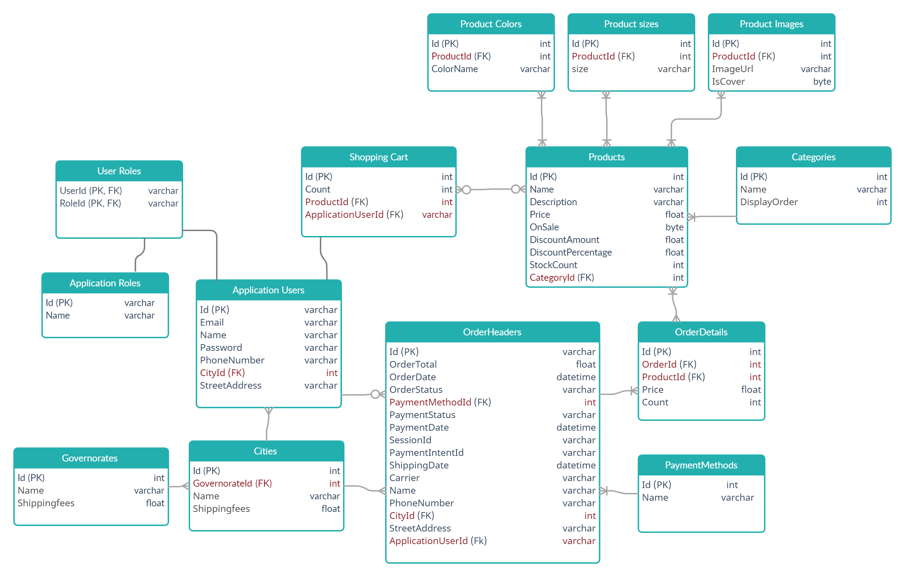

### In-Progress
# SADA-Site 
Online shopping system with both admin and user layouts. [click here](https://instagram.com/sada.suitss?utm_medium=copy_link)

# Features Provided
#### building with Asp.net Core MVC (.Net 6) and Bootstrap v5
- Categories
- Products
- Clients
- Cart
- Orders
- Payment
- Checkout

# Entity Relationship Diagram (ERD)
- ApplicationUser extends ASP.NET Core Identity that already includes [ApplicationUser, ApplicationRoles, UserRoles] tabels.

# How to Install and Run the Project

